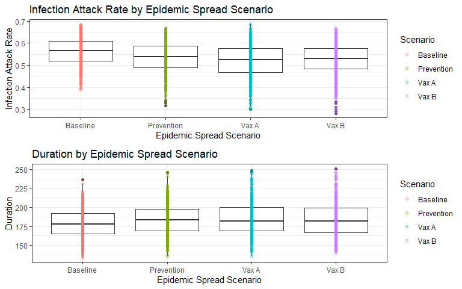
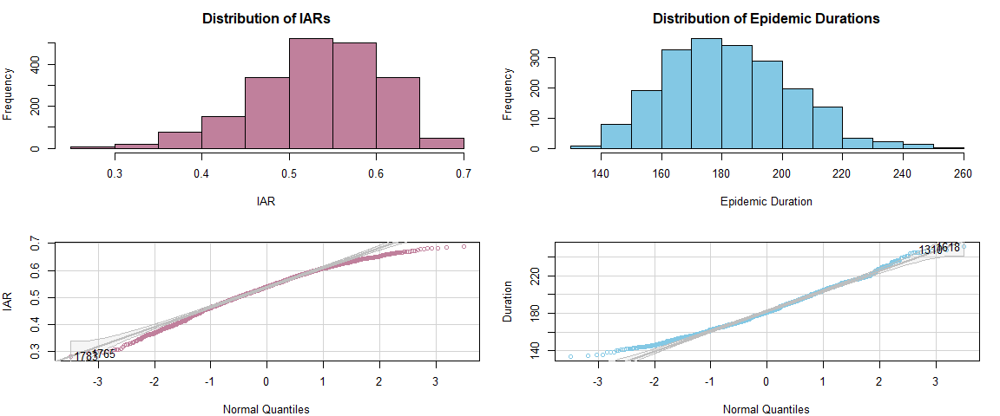
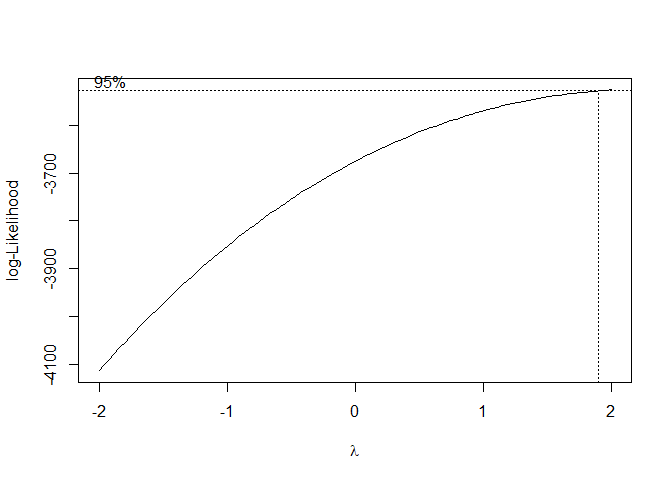
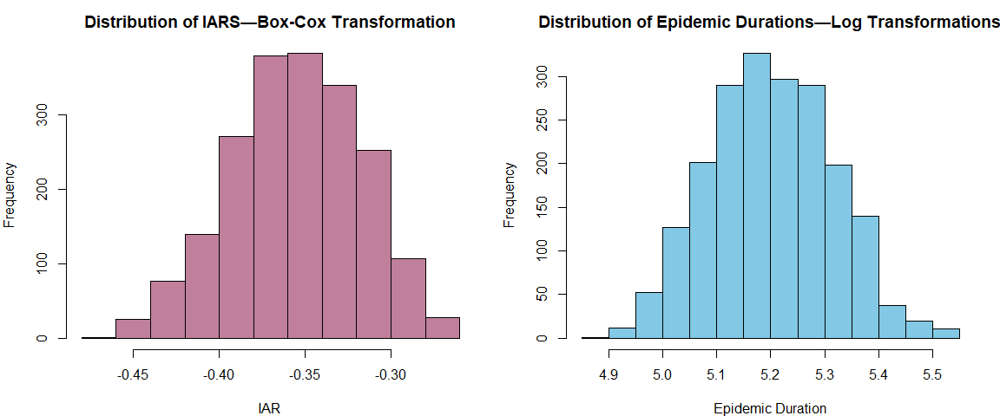
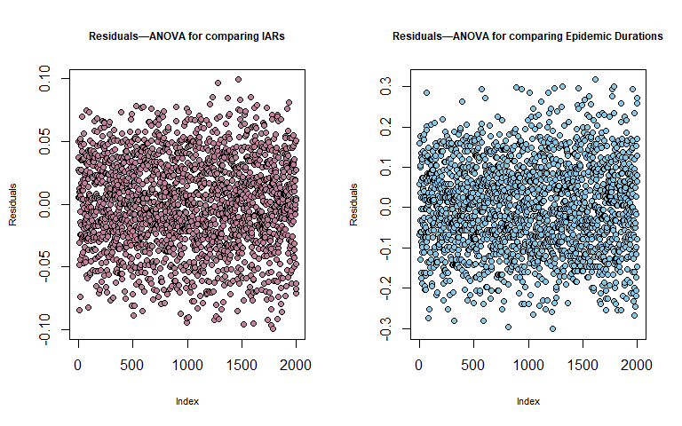
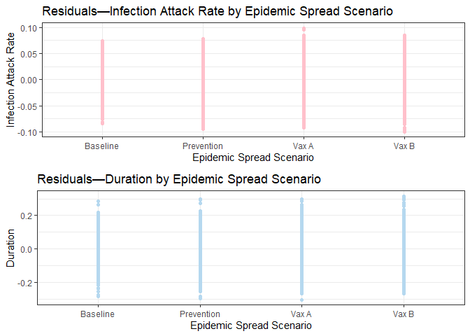

# Evaluating Success

The most effective vaccine distribution strategy may be one that can curb the epidemic the fastest, or one that can minimize the total number of infections.

## Disease-free Equilibrium

The disease-free equilibrium is the time at which the number of infected (infectious + exposed) individuals is zero, and the population only contains susceptible and recovered individuals. Generally, this is considered the time at which the epidemic comes to an end, as there are no more individuals who may transmit the disease to the population

$I(t) + E(t) = 0$

The duration of an epidemic is the number of days until the disease-free equilibrium is achieved.

## Infection Attack Rate

The infection attack rate of an epidemic is the total proportion of the population that’s eventually infected during the epidemic.

---

### Imports

```r
require(tidyverse)
```


```r
data_wide <- read.csv("results.csv")

data <- reshape(data_wide, dir="long", 
                varying=list(c(1,3,5,7), c(2,4,6,8)), 
                v.names=c("duration", "IAR"), 
                times=c("Baseline", "Prevention", "Vax A", "Vax B"), 
                new.row.names = sequence(prod(ncol(data_wide), nrow(data_wide)))
                )[,-4] %>%
    rename(scenario=time)
data <- data[data$duration != 1,] # drop rows where the epidemic never began
head(data)
```

```
##   scenario duration       IAR
## 1 Baseline      166 0.6271482
## 2 Baseline      188 0.5736318
## 3 Baseline      208 0.6469716
## 4 Baseline      166 0.6102303
## 5 Baseline      167 0.5865366
## 6 Baseline      172 0.4714134
```
 
---
 
# Exploratory Data Analysis
First, a quick plot:

```r
iar_box <- data %>%
    ggplot(aes(x=scenario, y = IAR)) +
    geom_boxplot() +
    geom_point(aes(col = scenario), alpha = 0.3) +
    labs(x = "Epidemic Spread Scenario", y = "Infection Attack Rate",
       title = "Infection Attack Rate by Epidemic Spread Scenario", col = "Scenario") +
    theme_bw()

dur_box <- data %>%
    ggplot(aes(x=scenario, y = duration)) +
    geom_boxplot() +
    geom_point(aes(col = scenario), alpha = 0.3) +
    labs(x = "Epidemic Spread Scenario", y = "Duration",
       title = "Duration by Epidemic Spread Scenario", col = "Scenario") +
    theme_bw()

gridExtra::grid.arrange(iar_box, dur_box, nrow=2)
```

<!-- -->

| IAR | Duration |
| --- | --- |
| Visually, there is a slight difference between the median IARs across all four groups. Vaccination A has the lowest median IAR. The spread of the IARs across all four groups also seems to be relatively constant. | By applying preventative measures, the epidemic is prolonged. The natural epidemic ends the fastest among all four cases. This may be because in the base case, the disease spreads quickly and infects a majority of the susceptible population. Once they recover, the disease cannot spread further as the number of susceptible individuals remaining is low.  |
|  |  |

We can now move to formal hypothesis tests. All following assertions are made at a significance level of 0.05.

---

## Test for Normality
There are 3 main assumptions to satisfy for a valid ANOVA/Tukey HSD test:

1. Normality: the data is normally distributed

2. Constant variance: the data have constant variance all the groups

3. Independence: the observations are independent random variables

The data were independently generated and based on the box plot, no group has higher/lower variance than any other group in the IAR/epidemic duration. Because of this, we will not test the data for assumptions 2 and 3 right now, but will evaluate them after model fitting to check for goodness of fit.

Let's begin by checking of the data is normally distributed to decide if any transformations are necessary:

```r
par(mfrow = c(2, 2), mar=c(4, 4, 2.5, 1.5))
hist(data$IAR, xlab="IAR", main="Distribution of IARs", col = "#C0809C")
hist(data$duration, xlab="Epidemic Duration", main="Distribution of Epidemic Durations", col = "#83C8E4")
car::qqPlot(data$IAR, xlab = "Normal Quantiles", ylab = "IAR", col = "#C0809C", col.lines="grey")
```

```
## [1] 1783 1765
```

```r
car::qqPlot(data$duration, xlab = "Normal Quantiles", ylab = "Duration", col = "#83C8E4", col.lines="grey")
```

<!-- -->

```
## [1] 1618 1310
```

Both the histogram and the Normal quantile-quantile plot suggest that

- The IARs have a left skew

- The epidemic durations have a right skew

This indicates that transformations are required. 

## Normality Transformations

The shape of the epidemic durations histogram suggests that a log transformation may be enough to normalize it.

For IARs, let's do a Box-Cox Transformation. We need a value for $\lambda$ to compute $y^{(\lambda)} = \frac{y^\lambda -1}{\lambda}$ such that $y^{(\lambda)}$ is normal.

```r
transf_attack <- MASS::boxcox(data$IAR~data$scenario)
```

<!-- -->

Based on this plot, $\lambda = 2$. Apply the respective transformations:


```r
par(mfrow = c(1, 2), mar=c(4, 4, 2.5, 1.5))
hist((((data$IAR)^2)-1)/2, xlab="IAR", main="Distribution of IARS—Box-Cox Transformation", col = "#C0809C")
hist(log(data$duration), xlab="Epidemic Duration", main="Distribution of Epidemic Durations—Log Transformations", col = "#83C8E4")
```

<!-- -->

The data isn't completely normal but looks more centered than before. Let's store the transformations in the dataframe and use these in our analysis.


```r
data$transformed_IAR <- (((data$IAR)^2)-1)/2
data$transformed_duration <- log(data$duration)
```

# ANOVA

Begin by directly applying a two-sided ANOVA to the simulated IARs and durations. This will tell us if there is a significant difference between more than two group means.

```r
# build model, check pairwise mean differences
aov_attack <- aov(transformed_IAR~scenario, data = data)
aov_duration <- aov(transformed_duration~scenario, data = data)
```


```r
summary(aov_attack)
```

```
##               Df Sum Sq Mean Sq F value Pr(>F)    
## scenario       3 0.1511 0.05036   37.95 <2e-16 ***
## Residuals   1996 2.6487 0.00133                   
## ---
## Signif. codes:  0 '***' 0.001 '**' 0.01 '*' 0.05 '.' 0.1 ' ' 1
```

```r
model.tables(aov_attack, type = "means")
```

```
## Tables of means
## Grand mean
##            
## -0.3550302 
## 
##  scenario 
## scenario
##   Baseline Prevention      Vax A      Vax B 
##    -0.3407    -0.3557    -0.3631    -0.3606
```


```r
summary(aov_duration)
```

```
##               Df Sum Sq Mean Sq F value   Pr(>F)    
## scenario       3  0.373 0.12428   9.996 1.54e-06 ***
## Residuals   1996 24.816 0.01243                     
## ---
## Signif. codes:  0 '***' 0.001 '**' 0.01 '*' 0.05 '.' 0.1 ' ' 1
```

```r
model.tables(aov_duration, type = "means")
```

```
## Tables of means
## Grand mean
##          
## 5.202479 
## 
##  scenario 
## scenario
##   Baseline Prevention      Vax A      Vax B 
##      5.179      5.209      5.214      5.209
```

Since the p-values are so low, we can conclude that the group means for the IARs and the durations are different across the groups.

We will use a Tukey's HSD test to compare the group means pairwise, for the IAR and the duration parameters separately.


```r
TukeyHSD(aov_attack)
```

```
##   Tukey multiple comparisons of means
##     95% family-wise confidence level
## 
## Fit: aov(formula = transformed_IAR ~ scenario, data = data)
## 
## $scenario
##                             diff          lwr           upr     p adj
## Prevention-Baseline -0.014996817 -0.020920581 -0.0090730526 0.0000000
## Vax A-Baseline      -0.022383783 -0.028307548 -0.0164600190 0.0000000
## Vax B-Baseline      -0.019945070 -0.025868834 -0.0140213052 0.0000000
## Vax A-Prevention    -0.007386966 -0.013310731 -0.0014632022 0.0074594
## Vax B-Prevention    -0.004948253 -0.010872017  0.0009755116 0.1385357
## Vax B-Vax A          0.002438714 -0.003485051  0.0083624781 0.7148298
```

Based on this result, we can say the following: 

1. Applying any combination of preventative measures significantly reduces the infection attack rate versus the baseline infection attack rate.

2. When vaccination strategy A is implemented in addition to basic preventative measures, we see a further significant drop in the infection attack rate.

3. Vaccination strategy B combined with basic preventative measures also precipitates an additional drop in the IAR but this difference is not statistically significant.

4. The infection attack rate is lower when vaccination strategy A is used as compared to vaccination strategy B. However, this difference is not statistically significant.


```r
TukeyHSD(aov_duration)
```

```
##   Tukey multiple comparisons of means
##     95% family-wise confidence level
## 
## Fit: aov(formula = transformed_duration ~ scenario, data = data)
## 
## $scenario
##                              diff         lwr        upr     p adj
## Prevention-Baseline  0.0294189545  0.01128674 0.04755116 0.0001847
## Vax A-Baseline       0.0344573903  0.01632518 0.05258960 0.0000066
## Vax B-Baseline       0.0296934371  0.01156123 0.04782565 0.0001560
## Vax A-Prevention     0.0050384358 -0.01309377 0.02317065 0.8913888
## Vax B-Prevention     0.0002744826 -0.01785773 0.01840669 0.9999788
## Vax B-Vax A         -0.0047639533 -0.02289616 0.01336826 0.9063801
```

Overall, adding any preventative measures seems to lengthen the duration of the epidemic compared to the baseline duration. This is in line with the box-plot above. 

The mean epidemic durations achieved in the basic prevention only, vaccination A and vaccination B categories are not statistically different.

---

## Goodness of Fit
Before accepting our conclusions, let's run some diagnostics on the model and check for goodness of fit. 

The test is typically robust to the assumption of normality being violated. Since our group sizes are equal, it's okay if constant variance is also violated. However, the data *must be* independent. 


```r
data$residuals_attack <- residuals(aov_attack)
data$residuals_duration <- residuals(aov_duration)
```

### Test for Independence
There is no way to directly prove independence, but we can check for correlated errors. If the errors are uncorrelated, we can conclude that independence is possible. However, since I generated the data randomly, I expect it to to be independent. Let's take a quick look at the residuals anyway.

```r
par(mfrow=c(1,2))
plot(data$residuals_attack, ylab = "Residuals", main = "Residuals—ANOVA for comparing IARs", pch = 21, bg = "#C0809C", col="black", cex.main = 0.75, cex.lab = 0.7)
plot(data$residuals_duration, ylab = "Residuals", main = "Residuals—ANOVA for comparing Epidemic Durations", pch = 21, bg = "#83C8E4", col="black", cex.main = 0.75, cex.lab = 0.7)
```

<!-- -->

The residuals are clearly randomly randomly dispered, indicating that the errors are uncorrelated.

### Test for Normality
We don't need to test for normality as we already created a plot of the data during EDA and transfromed it forcefully to approximately fit a normal distribution.


### Testing for Constant Variance
I already expect that the constant variance assumption is satisfied, because the initial boxplot showed the spread in each group to be approximately equal to the spread in the other groups.

Plot the residuals for each treatment group anyway:

```r
iar_res <- data %>%
    ggplot(aes(x=scenario, y = residuals_attack)) +
    geom_point(color = "pink") +
    labs(x = "Epidemic Spread Scenario", y = "Infection Attack Rate",
       title = "Residuals—Infection Attack Rate by Epidemic Spread Scenario") +
    theme_bw()

dur_res <- data %>%
    ggplot(aes(x=scenario, y = residuals_duration)) +
    geom_point(color = "#B5D8EF") +
    labs(x = "Epidemic Spread Scenario", y = "Duration",
       title = "Residuals—Duration by Epidemic Spread Scenario") +
    theme_bw()

gridExtra::grid.arrange(iar_res, dur_res, nrow=2)
```

<!-- -->

The residuals seem pretty evenly spread between the groups—there is no group with a much higher variability in residuals than any other group. This holds for the IARs and the epidemic durations, indicating that the constant variance assumption is not violated.

---

# Conclusions

Engaging in preventative behaviours prolongs the duration of an epidemic. This increase is not curbed by using vaccines.

In terms of reducing the total number of infected individuals, vaccination strategy A does confer statistically significant additional benefits when used with basic preventative measures.

The same cannot be said about vaccination strategy B.

Overall, we can conclude that vaccination strategy A is better than vaccination strategy B, but the difference is minute.
